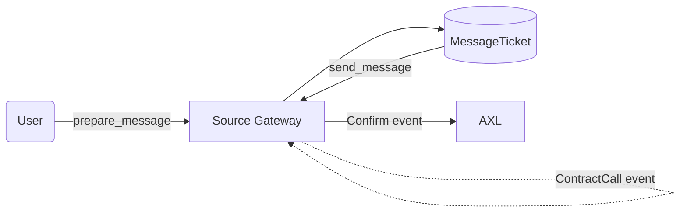
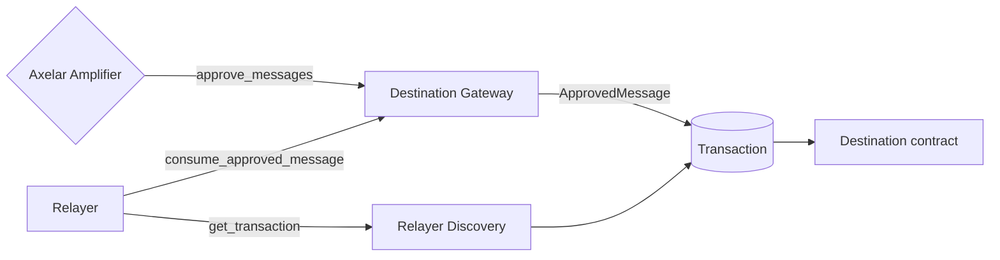
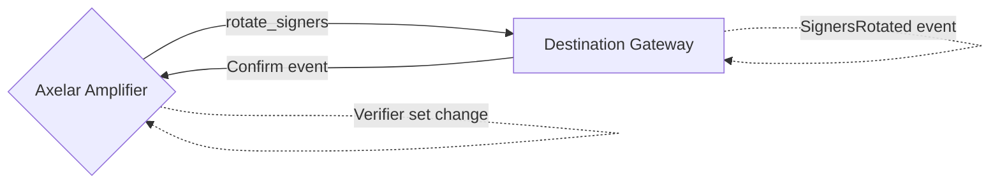

# Sui Axelar Gateway and ITS Integration

Sui is a smart contract chain that offers some unique design parameters. For this reason there have been a few differences between the implementation of smart contracts on Sui compared to EVM chains, that are used as reference

## General Limitations

### Design Limitation

There are quite a few differences between EVM and Sui.

In Sui, there are packages and modules that can run code, similar to EVM smart contracts. A big difference however is that Sui packages/modules do not have any storage available. Storage as a concept only exists on objects, which can be defined and controlled by modules. To access and modify any storage the corresponding object needs to be available. This means that conventional EVM smart contracts effectively combine the functionality of modules and objects in Sui.

Additionally there is a lack of interfaces whatsoever. It is impossible for a module to ever call another module that is published at a later time. This means applications that want to interface with future applications must be called by those future applications, but need to only call pre-existing ones. To expand on this, we expect contract calls that are received to potentially modify the storage of multiple objects in a single call, which makes it impossible to require modules to implement a 'standardized' function that a relayer will call, because the number of arguments required varies depending on the application (or the type of call).

Package "upgrades" result in a new, upgraded package being created, while preserving the old package. This new package can modify objects created by the old package, but any external modules that are using the old package will continued to do so, until they are upgraded too. This means that maintaining packages that depend on multiple existing packages is quite difficult if the dependancies are expected to upgrade.

Finally, we do not want to require the payload of incoming calls to have a certain format, because that would mean that working applications that want to exapnd to Sui need to redesign their working protocoll to accomodate Sui, discouraging them from doing so.

### Basic Limitations

See [this doc](https://move-book.com/guides/building-against-limits.html) for reference. The gas limit for sui is 50 SUI, which is over 100 times larger than any transaction needed for this context. There is also a transaction size limit of 128KB. Objects cannot be more than 256KB in size and there cannot be more than 1024 dynamic fields created on an object on a single transaction. See below for how these limitations affect potential designs.

## Axelar Gateway

The Axelar gateway is the remote interface for the Axelar Network to interract with any given chain. The reference implementation for such a smart contract can be found [here](https://github.com/axelarnetwork/axelar-cgp-solidity), with some design requirements found specifically [here](https://github.com/axelarnetwork/axelar-gmp-sdk-solidity/blob/main/contracts/gateway/INTEGRATION.md)

The Sui message sending looks like this

Receiving calls looks like this (see below for relayer discovery)

The verifier/signer rotation flow looks like the following:

## Relayer Discovery

