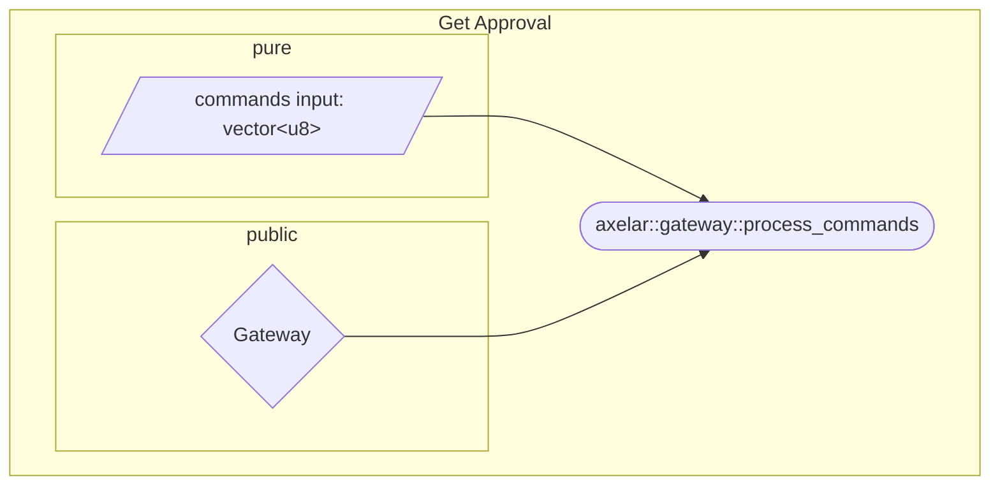
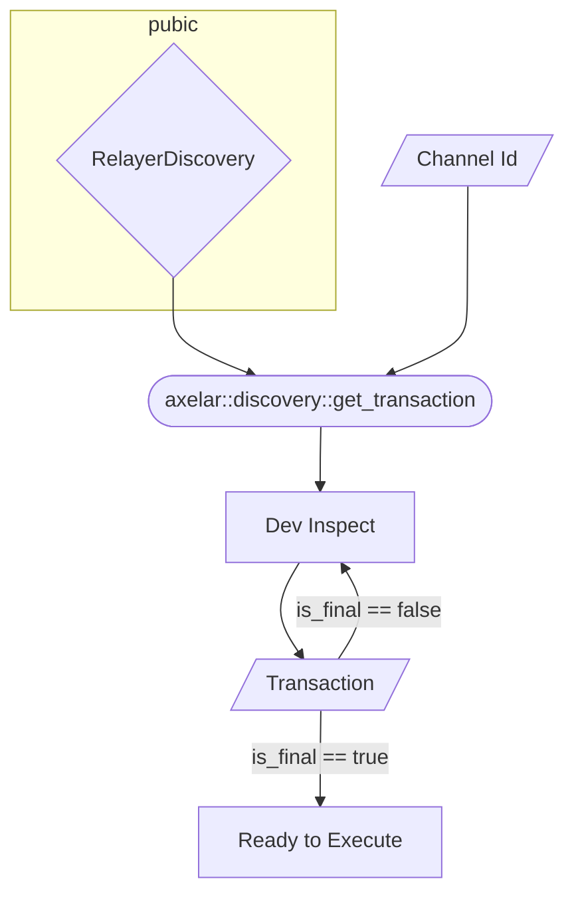
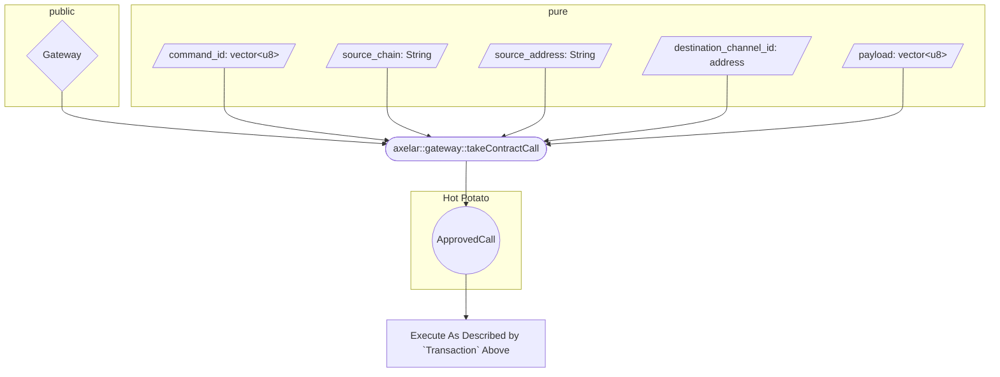
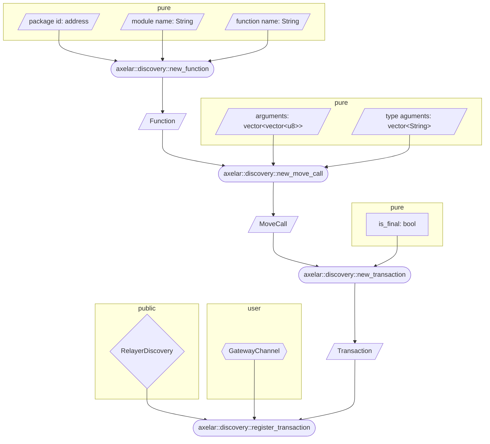
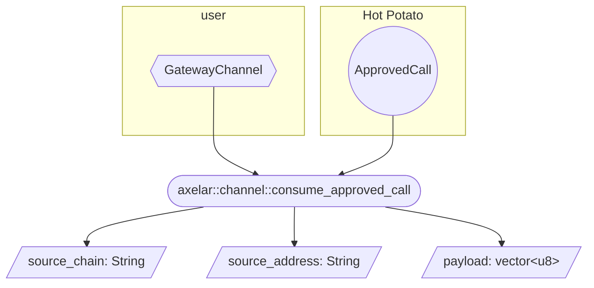

# Relayer Discovery

The only information about an incoming contract call through axelar are

- Command Id: A unique identifier for the command approving the call, 32 bytes long.
- Source Chain: The name of the source chain, as a String
- Source Address: The caller, as a String.
- Destination Chain: “Sui” for the purposes of this document
- Destination Address: The destination, a Sui address.

As we already explained, the destination address will be the `ID` of a `GatewayChannel` object that needs to be provided to consume the call. However there is no way for a relayer to know what they are supposed to call to get the call to be consumed, since they should not have access to the `GatewayChannel` object itself. This creates the need to make the destination for each incoming call publicly known so that any relayer can query it. 

## Transaction Object

The following objects are defined in the `axelar::discovery`  module and can be used to register/decode transactions.

```rust
struct Function has store, copy, drop {
	package_id: address,
	module_name: String,
	name: String,
}

/// Arguments are prefixed with:
/// - 0 for objects followed by exactly 32 bytes that cointain the object id
/// - 1 for pures followed by the bcs encoded form of the pure object
/// - 2 for the ApprovedCall object, followed by nothing (to be passed into the target function)
/// - 3 for the payload of the contract call (to be passed into the intermediate function)
/// - 4 for an argument returned from a previous move call, followed by a u8 specified which call to get the return of (0 for the first transaction AFTER the one that gets ApprovedCall out), and then another u8 specifying which argument to input.   
struct MoveCall has store, copy, drop {
	function: Function,
	arguments: vector<vector<u8>>,
	type_arguments: vector<String>,
}
    
public struct Transaction has store, copy, drop {
	is_final: bool,
	move_calls: vector<MoveCall>,
}
```

As seen above there are some options to allow for dynamic objects to be referenced that could not be known on chain, since they do not exist on chain (the `ApprovedCall` object, the payload of the incoming call and the returned arguments of a previous `MoveCall`). 

## Relayer Discovery

First the relayer needs to get a contract call approved:



Next, they need to figure out what to actually call to execute:



Finally, they need to get the `ApprovedCall` object from the gateway and use it to execute:



## Application

Anyone can register a `Transaction` for their channel using `axelar::discovery::register_transaction`:



Note that `new_transaction` takes a vector of `Transaction` objects, so the above is slightly simplified. To allow for complicated call receiving, the `is_final` field of a `Transaction` tells the relayer what to do with a given `Transaction` .

When a `Transaction` is final, the relayer will execute it. Note that during the transaction the application needs to consume the `ApprovedCall` object:



